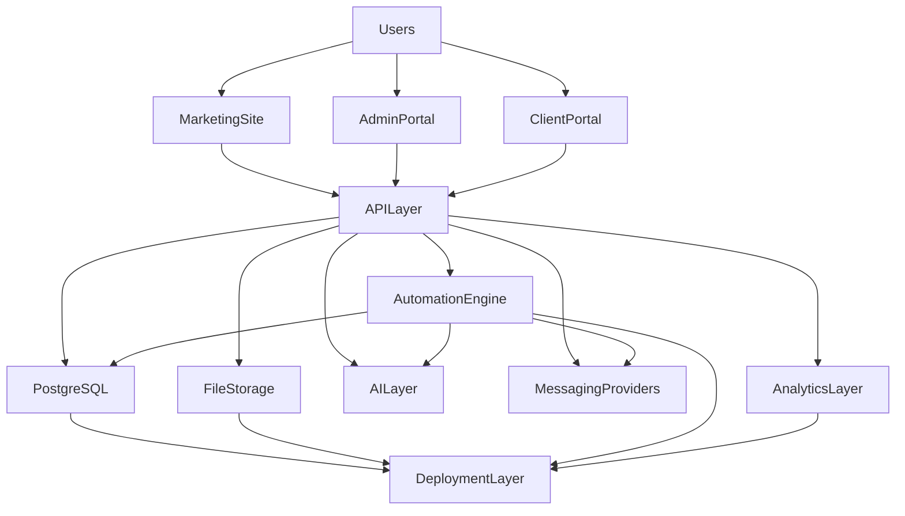
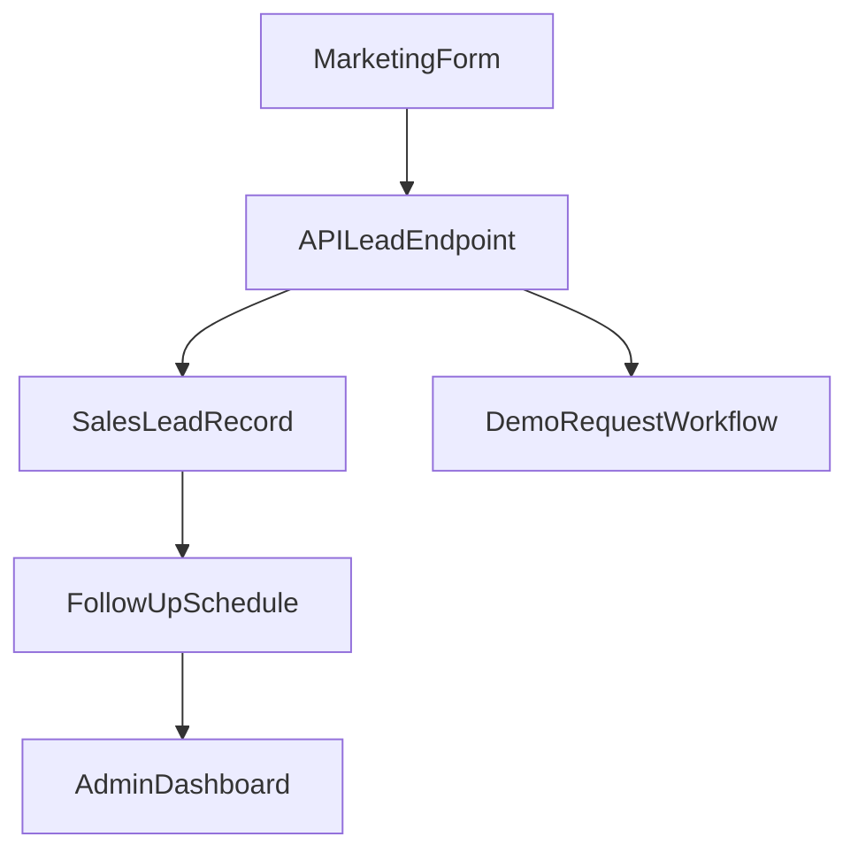
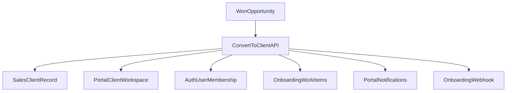

# Columbus AI System Overview

**Status:** Master architectural reference  
**Last updated:** June 2026  
**Primary reference:** [First Sellable Product](../product/first-sellable-product.md)

---

## Purpose

This document defines the complete Columbus AI platform architecture.

It is the master architectural reference for the platform and should guide future decisions about services, integrations, workflows, portals, data design, infrastructure, and deployment.

All future work should align with the business definition in [First Sellable Product](../product/first-sellable-product.md). Architecture exists to support the product outcome:

- capture leads
- automate follow-up
- convert prospects into clients
- onboard clients
- manage ongoing service delivery
- reduce administrative work

This document should be used when answering questions like:

- Where should a new feature live?
- Which system owns a piece of data?
- How should a workflow move across portals and services?
- What is implemented today versus planned for later?
- How should new integrations fit into the platform?

---

## High-Level Platform Diagram

### Current architectural truth

Today, Columbus AI is primarily:

- A monorepo with separate marketing, admin, portal, and API apps
- A shared PostgreSQL-backed platform
- A self-hosted n8n automation layer
- A single-VPS Docker deployment behind Traefik
- A product that is still consolidating around one sellable workflow

### Architectural positioning

Columbus AI should remain a **shared platform** with **clear module boundaries**, not a collection of disconnected tools. The architecture should optimize for:

- operational simplicity
- shared data ownership
- fast iteration
- clear workflow visibility
- secure handling of business and client data

---

## Platform Components

Each component below describes purpose, responsibilities, data ownership, dependencies, failure impact, and future expansion opportunities.

---

## Marketing Site

**Purpose:** Capture interest, explain the offer, and route inbound prospects into the lead lifecycle.

**Responsibilities:**

- Public-facing marketing pages
- Contact and demo request capture
- Brand presentation and positioning
- Optional chat entry point

**Data ownership:**

- Owns presentation-only marketing content
- Does **not** own lead records after submission

**Dependencies:**

- API layer for lead submission
- Deployment layer for public hosting
- Future analytics layer for attribution and conversion tracking

**Failure impact:**

- Leads may be lost if forms fail
- Marketing conversion drops if pages are down or degraded

**Future expansion opportunities:**

- Additional landing pages by industry
- Better attribution tracking
- Calendar booking integration
- Richer conversational qualification before lead creation

---

## Admin Portal

**Purpose:** Serve as the business owner's operational control center.

**Responsibilities:**

- Dashboard and operational triage
- Lead and client management
- Task, document, and message visibility
- Automation status review
- Business configuration and settings

**Data ownership:**

- Does not own platform data directly
- Consumes and mutates data owned by the API and database

**Dependencies:**

- API layer
- Auth/session system
- Database
- Automation status from n8n or API-owned summaries

**Failure impact:**

- Owner loses operational visibility
- Manual work increases
- Lead and client action may be delayed

**Future expansion opportunities:**

- More refined dashboard widgets
- Better work queues
- Proposal workflow
- Unified communication center

**Current state note:** Admin routes and core sales screens exist, but the portal is not yet fully aligned to the MVP operations-center definition in [Admin Portal](../product/admin-portal.md).

---

## Client Portal

**Purpose:** Give clients a structured place to view status, complete onboarding, exchange context, and eventually manage documents and service requests.

**Responsibilities:**

- Client authentication and session handling
- Work Center and request visibility
- Onboarding tasks
- Notifications
- Client-facing activity context

**Data ownership:**

- Does not own source-of-truth business data
- Presents and updates client-scoped data from API and database

**Dependencies:**

- API layer
- Auth/session system
- Database
- Future file storage for document uploads

**Failure impact:**

- Client experience degrades
- Onboarding becomes manual
- Owners revert to email/text coordination

**Future expansion opportunities:**

- Real document upload pipeline
- Richer messaging
- Service-specific dashboards
- Appointment and calendar visibility

**Current state note:** Portal auth, work items, comments, notifications, and onboarding-driven flows exist; several sidebar areas remain mock or scaffold-level.

---

## API Layer

**Purpose:** Act as the central application boundary for business logic, auth, workflow orchestration, and shared data access.

**Responsibilities:**

- Lead capture and lifecycle endpoints
- Auth and sessions
- Portal work item APIs
- Client conversion and provisioning
- Chat / AI endpoints
- Validation, authorization, and audit behavior

**Data ownership:**

- Owns application logic and write rules
- Does not persist independently from PostgreSQL

**Dependencies:**

- PostgreSQL
- Redis / rate limiting
- OpenAI for chat
- n8n webhooks and automation coordination
- Deployment environment and secrets

**Failure impact:**

- Entire platform becomes degraded or unavailable
- Lead capture fails
- Portal and admin operations stop

**Future expansion opportunities:**

- More explicit domain services for CRM, documents, messaging, and analytics
- Better event publication model
- Stronger integration APIs for external systems

---

## Database

**Purpose:** Provide the primary source of truth for operational platform data.

**Responsibilities:**

- Store auth, portal, sales, chat, and automation records
- Support lifecycle transitions and auditability
- Back both admin and portal experiences

**Data ownership:**

- `auth` schema: users, sessions, client memberships, audit events
- `portal` schema: clients, work items, comments, attachments, notifications
- `sales` schema: leads, opportunities, clients
- `chat` schema: conversations and message metadata
- `automation` schema: current and planned automation data

**Dependencies:**

- API layer for application access
- n8n for workflow reads/writes
- Deployment layer for storage, backup, and availability

**Failure impact:**

- Platform-wide operational failure
- Loss of workflow continuity
- Lead and client history unavailable

**Future expansion opportunities:**

- Richer automation schema
- Better reporting models
- Durable document metadata model
- Stronger event-oriented operational tables

**Current state note:** The current database uses one PostgreSQL instance with three logical databases: platform (`columbus`), vectors (`columbus_vectors`), and n8n metadata (`n8n`).

---

## File Storage

**Purpose:** Store client and operational files tied to onboarding, delivery, and document request workflows.

**Responsibilities:**

- File upload persistence
- Object retrieval
- Document metadata association
- Access control by client and staff role

**Data ownership:**

- Owns binary files and object storage state
- Database should own metadata and references

**Dependencies:**

- API layer for signed uploads/download authorization
- Database for document metadata
- Client and admin portals for upload/review workflows

**Failure impact:**

- Document workflows break
- Onboarding and service delivery become manual
- Clients lose a key self-service capability

**Future expansion opportunities:**

- Storage provider abstraction
- Versioning and approval workflows
- OCR and AI extraction for documents

**Current state note:** This is an MVP target, not a fully implemented platform capability today. Document UI exists, but durable file-storage architecture is still planned.

---

## Automation Engine

**Purpose:** Execute predictable operational workflows so the business does not rely on memory and manual follow-up.

**Responsibilities:**

- Demo-request workflow execution
- Follow-up scheduling and delivery
- Workflow retries and operational alerts
- Future onboarding and reminder workflows

**Data ownership:**

- n8n owns execution runtime state
- PostgreSQL remains source of truth for business entities

**Dependencies:**

- n8n
- API layer
- Database
- Messaging/email providers
- AI services when used in workflows

**Failure impact:**

- Leads may not be followed up
- Onboarding reminders may fail
- Manual work increases immediately

**Future expansion opportunities:**

- More onboarding workflows
- Task-generation workflows
- Re-engagement flows
- Better admin automation observability

**Current state note:** MVP automations are centered on n8n, not an in-app workflow-builder.

---

## Messaging Layer

**Purpose:** Deliver and organize communications tied to leads, clients, and workflows.

**Responsibilities:**

- Outbound workflow messaging
- Future email/SMS/channel integrations
- Message delivery status and notification hooks

**Data ownership:**

- Provider owns transport/delivery infrastructure
- Columbus should own communication metadata and business context

**Dependencies:**

- API layer
- Automation engine
- Future provider integrations

**Failure impact:**

- Follow-up and notification workflows fail
- Client communication becomes fragmented

**Future expansion opportunities:**

- Resend or transactional email providers
- Twilio or SMS providers
- Unified communication timeline
- Client reply ingestion

**Current state note:** Message transport for the implemented follow-up workflow is handled through n8n configuration. A generalized messaging layer is not yet fully productized.

---

## AI Layer

**Purpose:** Support selective AI-assisted workflows without redefining the core product around AI novelty.

**Responsibilities:**

- Chat API interactions
- Workflow-side AI assistance where useful
- Future summarization, extraction, or classification support

**Data ownership:**

- AI providers should not be treated as system-of-record
- Columbus owns prompts, context, and persisted results where needed

**Dependencies:**

- OpenAI and future AI providers
- API layer
- Automation engine
- Vector database for future retrieval use cases

**Failure impact:**

- Chat features degrade
- AI-assisted workflows may fail or lose enrichment
- Core operations should still continue where AI is non-critical

**Future expansion opportunities:**

- Lead summarization
- Proposal drafting
- Document extraction
- Retrieval-assisted support tools
- More advanced AI agents after MVP

**Current state note:** AI exists in a limited form today through chat endpoints and workflow usage; advanced AI agents are explicitly post-MVP.

---

## Analytics Layer

**Purpose:** Measure whether the platform is improving business outcomes.

**Responsibilities:**

- Track lead and client lifecycle metrics
- Provide operational trend visibility
- Support conversion and workflow reporting

**Data ownership:**

- Core metrics should derive from application data in PostgreSQL
- Event analytics may be emitted to an analytics provider later

**Dependencies:**

- Database
- API layer
- Future analytics event pipeline

**Failure impact:**

- Operations may continue, but visibility into trends and improvement is weakened

**Future expansion opportunities:**

- Product analytics (e.g. PostHog)
- Funnel attribution
- Cohort and retention analysis
- Automation effectiveness dashboards

**Current state note:** Analytics is partly conceptual today. Dashboard and operational counts matter more than a mature analytics stack in MVP.

---

## Deployment Layer

**Purpose:** Run the platform reliably across local, staging, and production environments.

**Responsibilities:**

- Container orchestration via Docker Compose
- Reverse proxy and TLS via Traefik
- Service routing
- Environment injection
- Deployment workflow and verification

**Data ownership:**

- Owns runtime configuration and infrastructure state
- Does not own application domain data

**Dependencies:**

- VPS / Hostinger
- Docker
- Traefik
- PostgreSQL data volumes
- CI/CD pipeline

**Failure impact:**

- Outage or degraded access across one or more apps
- Failed deploys can break public site, admin, portal, API, or n8n

**Future expansion opportunities:**

- More automated provisioning
- Better monitoring and alerting
- More formal staging environment
- Backup and restore hardening

---

## Data Flow

This section defines the main data movements across the platform.

---

## Lead Creation

### Flow

1. A prospect submits a marketing form.
2. The marketing app sends data to the API.
3. The API validates and creates a lead record in PostgreSQL.
4. The API optionally triggers the demo-request workflow in n8n.
5. Follow-up scheduling data is stored on the lead record.
6. Admin dashboard and lead views reflect the new lead and next step.

### Ownership

- Marketing owns capture UI
- API owns validation and business logic
- PostgreSQL owns lead record and lifecycle state
- n8n owns workflow execution

---

## Client Onboarding

### Flow

1. Admin marks an opportunity as won or explicitly converts it.
2. API creates or updates the sales client record.
3. API provisions portal client data and auth membership.
4. API generates onboarding work items and notifications.
5. Optional webhook notifies external automation tools.

### Ownership

- Admin Portal owns operator action
- API owns orchestration
- Database owns resulting client, auth, and portal records
- n8n or external systems may extend onboarding behavior

---

## Document Uploads

### Intended MVP flow

1. Admin or client requests a document.
2. Client uploads file through portal.
3. API validates access and writes document metadata.
4. File storage persists the binary file.
5. Dashboard and client profile reflect request status.

### Current reality

- The UI concept exists.
- Durable file storage and document metadata flow are still planned.

### Ownership model

- File storage owns binary content
- Database owns metadata, request state, and access relationships

---

## Messaging

### Current flow

1. Communication context is stored primarily through work item comments and activity records.
2. Admin and portal users read/write message-like records through API-backed work flows.
3. Notifications surface items requiring attention.

### Target flow

1. Messages are tied to leads or clients.
2. Internal notes and client-visible messages are clearly separated.
3. Notification handling and message state feed dashboard urgency widgets.

### Ownership model

- Database owns communication context
- Messaging providers own transport
- API owns permissions and business rules

---

## Automations

### Current flow

1. API or schedule conditions determine that a workflow should run.
2. n8n executes the workflow.
3. Workflow reads/writes operational state in PostgreSQL or triggers outbound communication.
4. Admin is alerted if the workflow fails or if a resulting action is still needed.

### Ownership model

- PostgreSQL owns entity truth
- n8n owns execution logic
- Admin Portal should own operational visibility into success/failure

---

## Analytics Events

### Intended flow

1. Operational events occur in the API and database.
2. Events are summarized for dashboard and reporting.
3. Selected events may be emitted to an analytics provider in the future.

### Examples

- Lead created
- First contact made
- Lead qualified
- Proposal sent
- Client created
- Onboarding completed
- Automation failed

### Ownership model

- Database remains source of truth
- Analytics systems should consume derived events, not become the primary data store

---

## Integration Architecture

Integrations should support the core product workflow, not distort it.

---

## n8n

**Purpose:** Execute automations such as demo-request handling and scheduled follow-up.

**Direction of data flow:**

- API → n8n (webhook triggers)
- n8n ↔ PostgreSQL (workflow reads/writes)
- n8n → outbound providers (email / workflow actions)

**Ownership:**

- n8n owns automation execution logic
- API and database own business truth

**Security considerations:**

- Restrict n8n access with auth
- Limit environment variables exposed to workflows
- Treat workflow credentials as sensitive secrets

---

## Resend

**Purpose:** Candidate future transactional email provider for operational messages and notifications.

**Direction of data flow:**

- API or automation engine → Resend → recipient

**Ownership:**

- Resend would own delivery transport
- Columbus must own communication intent, metadata, and message context

**Security considerations:**

- Protect API keys
- Avoid exposing provider secrets to frontend apps
- Preserve auditability of important outbound communication

**Current state:** Not a core implemented provider in the current repo; included here as planned integration architecture.

---

## PostHog

**Purpose:** Candidate future analytics platform for product and funnel instrumentation.

**Direction of data flow:**

- Marketing / admin / portal / API → PostHog events

**Ownership:**

- PostHog would own event analytics storage
- PostgreSQL remains source of truth for operational records

**Security considerations:**

- Avoid sending sensitive client or document contents
- Separate operational metrics from privacy-sensitive event payloads

**Current state:** Planned, not foundational to MVP operations today.

---

## Google Calendar

**Purpose:** Candidate future calendar integration for appointments, demos, onboarding calls, and scheduling visibility.

**Direction of data flow:**

- Columbus → calendar event creation
- Calendar → Columbus synchronization of meeting state

**Ownership:**

- Google Calendar owns event transport and calendar system state
- Columbus owns business context and relationship to lead/client records

**Security considerations:**

- OAuth credentials and scopes must be limited
- Calendar sync should follow least privilege
- Sensitive internal notes should not leak into calendar event payloads

**Current state:** Mentioned as a desirable integration pattern; not a core implemented dependency for the MVP workflow.

---

## Future integrations

Future integrations should be evaluated using the product's feature framework:

- Does this help acquire?
- Does this help onboard?
- Does this help serve?
- Does this help retain?
- Does this reduce manual work?
- Does this increase operational visibility?

Examples of future integrations:

- Email providers
- SMS / messaging providers
- Calendar systems
- Document signing platforms
- Billing providers
- CRM import sources

---

## Security Principles

Security architecture should follow these principles:

### Authentication

- Session-based auth via API and PostgreSQL-backed sessions
- Admin and portal auth should avoid duplicative auth stacks
- Supabase is frozen and should not receive new feature development

### Authorization

- Enforce role-based access for admin and portal users
- Separate agency/internal permissions from client-visible permissions
- Keep document and messaging visibility scoped carefully

### Data segregation

- Separate auth, sales, portal, chat, and automation concerns in schema design
- Ensure client-scoped access is enforced in API logic, not only UI

### Audit logging

- Important events should be recorded for traceability
- Conversions, provisioning, comments, and critical actions should remain reviewable

### Secrets management

- Secrets live in environment files and deployment configuration
- Never expose provider secrets to client applications
- Keep workflow credentials isolated and rotated when needed

### Least privilege

- Grant minimal provider scopes
- Avoid broad infrastructure or provider permissions unless justified
- Limit who can perform destructive or high-impact admin actions

---

## Deployment Architecture

### Current architecture

- Monorepo repository structure
- Docker Compose for local, staging, and production stacks
- Traefik reverse proxy for routing and TLS
- PostgreSQL as central data store
- API as shared application backend
- Single VPS deployment on Hostinger
- CI/CD through install, lint, typecheck, test, and smoke verification workflows
- Backups and monitoring are present operational concerns but should continue to be hardened

### Service routing

- `columbusai.tech` → marketing
- `api.columbusai.tech` → API
- `admin.columbusai.tech` → admin
- `portal.columbusai.tech` → portal
- `n8n.columbusai.tech` → n8n

### Architectural implications

- This is a monolith-in-a-monorepo deployment model, not a microservice platform
- Shared infrastructure keeps complexity low and workflow coordination simple
- The architecture is appropriate for MVP and early customers

---

## Future Architecture Roadmap

The following items are intentionally future-facing and should not distort MVP architecture today:

- Advanced AI agents
- Marketplace integrations
- Billing
- White labeling
- Native mobile applications
- Multi-tenant enterprise capabilities

Additional future architecture possibilities:

- More robust file-storage and document services
- Better observability and alerting pipelines
- Expanded analytics event infrastructure
- Stronger event-driven automation patterns

These should be approached only after the first sellable product is proven.

---

## Architectural Principles

1. **Simplicity before complexity**  
   Choose the fewest moving parts that can reliably support the product.

2. **Monolith before microservices**  
   Keep the system integrated and easy to reason about until scale or domain boundaries truly demand separation.

3. **Shared platform before duplicate systems**  
   One workflow should not be rebuilt separately in marketing, admin, portal, and automations without a clear reason.

4. **Automation before manual processes**  
   If a repeatable business step can be encoded safely, architecture should support that automation.

5. **Observability by default**  
   Critical workflows should expose enough logs, state, and failure visibility for operators to act quickly.

6. **Security by default**  
   Authentication, authorization, data access, and secret handling should be treated as core architecture, not later polish.

7. **Business outcomes over technical novelty**  
   The architecture should make Columbus AI more sellable and operable, not merely more sophisticated.

---

## Architecture Success Definition

The Columbus AI architecture is successful when:

- Lead capture, follow-up, conversion, onboarding, and ongoing service all run on one coherent platform
- Owners and clients interact through shared, trustworthy workflows
- Automations reduce manual work without obscuring operational visibility
- Data has clear ownership and predictable flows
- New features can be added without creating duplicate systems or conflicting sources of truth

If the platform becomes harder to understand than the business process it supports, the architecture is moving in the wrong direction.

---

## Related Documentation

- [First Sellable Product](../product/first-sellable-product.md)
- [Admin Portal](../product/admin-portal.md)
- [Client onboarding](../product/onboarding.md)
- [Lead lifecycle](../workflows/lead-lifecycle.md)
- [Demo request workflow](../workflows/demo-request-workflow.md)
- [Follow-up workflow](../workflows/follow-up-workflow.md)
- [Environment](./environment.md)
- [Deployment](./deployment.md)
- [Postgres](./postgres.md)
- [Auth consolidation](./auth-consolidation.md)
- [n8n workflow sync](./n8n-workflow-sync.md)
