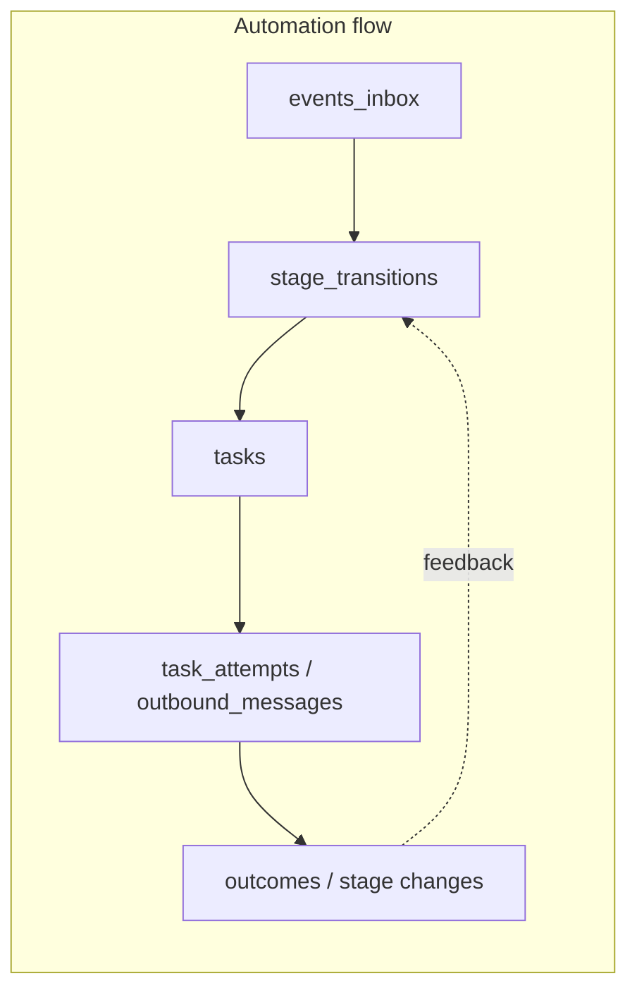

# Prisma automation OS schema implementation

## Core principle

Everything hangs off **clients** and flows through:

`events_inbox → stage_transitions → tasks → task_attempts/messages → outcomes → stage changes`

Notion is a synced UI; store `notion_page_id` on client and tasks.

## Current state

- **Schema source**: [packages/db/prisma/schema.prisma](packages/db/prisma/schema.prisma) (used by `apps/api` via `@columbusai/db`). [apps/web/prisma/schema.prisma](apps/web/prisma/schema.prisma) is a duplicate; keep in sync.
- **DB**: PostgreSQL with Prisma `multiSchema`; only `chat` schema in use. New tables go in schema `automation`.
- **Conventions**: Prisma camelCase; `@@map("snake_case")` for table/column names; all automation timestamps `@db.Timestamptz(6)`.

---

## 1) Step-by-step plan

| Step | Action |
|------|--------|
| 1 | Add `"automation"` to `datasource db { schemas = ["chat", "automation"] }` in [packages/db/prisma/schema.prisma](packages/db/prisma/schema.prisma). |
| 2 | Add automation models in dependency order (Section 2). Use **String** for all enum-ish fields (system_stage, manual_override, processing_status, status, priority, channel, etc.) with `// e.g. ...` comments; no Prisma enums so the schema stays flexible and matches your text columns. |
| 3 | Use `@db.Timestamptz(6)` for every DateTime. Use `Json` for jsonb (payload, metadata, require_fields, result, raw_payload). |
| 4 | In Prisma, define **email / primary_email / to_email as String**. Create initial migration so tables exist. |
| 5 | Add **manual migration** (Section 3): enable `citext` extension and `ALTER` those columns to `citext`. Prisma continues to read/write as String; DB enforces case-insensitive uniqueness and comparison. |
| 6 | Add **manual migration** for partial indexes (Section 3): unique(primary_email) where not null; index on (needs_human_action) where true; tasks partial index (execute_at) where status='queued' and automation_eligible=true. |
| 7 | Run migrations from `packages/db`: `npx prisma migrate dev --name add_automation_schema`, then apply manual SQL. |
| 8 | Add minimal seed script (Section 4) and validation checklist (Section 5). |

---

## 2) Prisma schema additions (full)

**Datasource**

```prisma
datasource db {
  provider = "postgresql"
  url      = env("DATABASE_URL")
  schemas  = ["chat", "automation"]
}
```

### 1) users

- `id` uuid pk @default(uuid())
- `created_at` @db.Timestamptz(6) @default(now())
- `email` String? @unique  // citext in DB via manual migration
- `display_name` String?
- `role` String?  // admin/sales/ops
- `is_active` Boolean @default(true)
- Relations: `clientsOwned` Client[], `taskTemplatesDefaultOwner` TaskTemplate[]

### 2) clients

- id uuid pk, created_at, updated_at @db.Timestamptz(6)
- **Identity**: display_name, first_name, last_name, primary_email (String?; citext in DB), primary_phone, company_name, role, website, source String?
- **Ownership**: owner_user_id uuid? fk → users.id, priority, timeline, team_size, budget_band
- **Pipeline**: system_stage String, manual_override String @default("none"), stage_updated_at, lost_reason, discovery_cancelled_reason, discovery_cancelled_at
- **Follow-up**: followup_state String @default("active"), followup_sequence_key, followup_step Int @default(0), next_followup_at, sla_due_at, needs_human_action Boolean @default(false), last_contact_at, last_followup_type, followup_count Int @default(0), followup_stop_reason
- **Meeting**: meeting_status String @default("not_scheduled"), meeting_provider, meeting_link, meeting_external_id, meeting_start_at, meeting_end_at
- **Billing**: proposed_setup_fee_cents Int?, invoice_status String @default("not_sent"), stripe_customer_id, stripe_invoice_id, last_payment_at
- **Compliance**: subscribed Boolean @default(true), unsubscribed_at, automation_lock Boolean @default(false)
- notion_page_id String?
- @@index([system_stage, next_followup_at]), @@index([meeting_external_id]), @@index([stripe_customer_id]), @@index([stripe_invoice_id])
- Partial index (needs_human_action) and unique(primary_email) → manual SQL (Section 3)

### 3) events_inbox

- id uuid pk, event_id String, event_type String, source String, occurred_at @db.Timestamptz(6), received_at @db.Timestamptz(6) @default(now())
- client_lookup_key String?, client_id uuid? fk → clients.id
- payload Json, processed_at DateTime?, processing_status String @default("pending"), last_error String?
- @@unique([source, event_id])
- @@index([processing_status, received_at]), @@index([client_id, occurred_at])

### 4) stage_transitions

- id uuid pk, client_id uuid fk → clients.id, from_stage String?, to_stage String, reason String?, triggered_by String
- event_inbox_id uuid? fk → events_inbox.id, workflow_name String?, execution_id String?, occurred_at @db.Timestamptz(6) @default(now()), metadata Json?
- @@index([client_id, occurred_at(sort: Desc)]), @@index([to_stage, occurred_at(sort: Desc)])

### 5) task_templates

- id uuid pk, name String, is_active Boolean @default(true)
- **Trigger**: trigger_stage String?, stage_trigger_type String, trigger_event_type String?
- **Scheduling**: offset_type String, offset_value Int @default(0), offset_unit String @default("days"), recurrence_rrule String?
- **Task**: task_key String @unique, task_type String, priority String @default("medium"), assign_to String @default("auto"), default_owner_user_id uuid? fk → users.id
- automation_eligible Boolean @default(true), cancel_if_stage_changes Boolean @default(true), prevent_duplicate Boolean @default(true), required Boolean @default(false)
- **Channel**: channel String, subject_template String?, message_template String?, booking_link_template String?
- require_fields Json?, metadata Json?
- @@index([is_active, trigger_stage, stage_trigger_type])

### 6) tasks

- id uuid pk, client_id uuid fk → clients.id, template_id uuid? fk → task_templates.id
- task_key String, dedupe_key String @unique, source_event_inbox_id uuid? fk → events_inbox.id
- status String @default("queued"), priority String @default("medium"), needs_human_action Boolean @default(false), automation_eligible Boolean @default(true), manual_override String @default("none")
- created_at, updated_at @db.Timestamptz(6), execute_at @db.Timestamptz(6), due_at, sla_due_at
- channel String, to_email String?, to_phone String?, subject String?, message String? @db.Text, booking_link String?
- locked_until, locked_by String?, attempt_count Int @default(0), last_attempt_at, last_error String?, processed_at, outcome String?, outcome_notes String?, metadata Json?
- notion_page_id String?
- @@index([status, automation_eligible, execute_at]), @@index([locked_until]), @@index([client_id, status])
- Partial index (execute_at) where status='queued' and automation_eligible=true → manual SQL

### 7) task_attempts

- id uuid pk, task_id uuid fk → tasks.id onDelete Cascade
- attempt_no Int, started_at @db.Timestamptz(6) @default(now()), finished_at DateTime?, execution_id String?, status String, error String?, result Json?
- @@index([task_id, attempt_no(sort: Desc)])

### 8) outbound_messages

- id uuid pk, client_id uuid? fk → clients.id, task_id uuid? fk → tasks.id
- channel String, provider String?, provider_message_id String?, to_address String?, subject String?, body String? @db.Text
- sent_at @db.Timestamptz(6) @default(now()), delivery_status String?, delivered_at DateTime?, bounced_at DateTime?, error String?, metadata Json?
- @@index([provider_message_id]), @@index([client_id, sent_at(sort: Desc)])

### 9) meetings

- id uuid pk, client_id uuid fk → clients.id, provider String, external_id String, status String
- start_at, end_at @db.Timestamptz(6)?, meeting_link String?, raw_payload Json?, created_at @db.Timestamptz(6) @default(now())
- @@unique([provider, external_id])

### 10) invoices

- id uuid pk, client_id uuid fk → clients.id, provider String @default("stripe"), external_invoice_id String
- status String, amount_cents Int, currency String @default("usd"), invoice_url String?, due_at, sent_at, paid_at DateTime?
- raw_payload Json?, created_at @db.Timestamptz(6) @default(now())
- @@unique([provider, external_invoice_id])

### 11) payments

- id uuid pk, client_id uuid fk → clients.id, invoice_id uuid? fk → invoices.id, provider String @default("stripe"), external_payment_id String
- status String, amount_cents Int, currency String @default("usd"), paid_at DateTime?, raw_payload Json?, created_at @db.Timestamptz(6) @default(now())
- @@unique([provider, external_payment_id])

### 12) client_identities

- id uuid pk, client_id uuid fk → clients.id onDelete Cascade, kind String, value String, is_primary Boolean @default(false), created_at @db.Timestamptz(6) @default(now())
- @@unique([kind, value]), @@index([client_id, kind])

### 13) automation_locks

- lock_key String @id  // text PK; map to "lock_key" if needed
- locked_until @db.Timestamptz(6), locked_by String?, created_at @db.Timestamptz(6) @default(now())

All automation models: `@@schema("automation")` and `@@map("snake_case")` table names. All DateTime fields in automation: `@db.Timestamptz(6)`.

---

## 3) Manual SQL migrations (CITEXT + partial indexes)

Run after the initial Prisma-generated migration (tables created with TEXT).

**3a) Enable CITEXT and convert email columns**

```sql
CREATE EXTENSION IF NOT EXISTS citext;

ALTER TABLE automation.clients   ALTER COLUMN primary_email TYPE citext;
ALTER TABLE automation.users     ALTER COLUMN email TYPE citext;
ALTER TABLE automation.tasks     ALTER COLUMN to_email TYPE citext;
```

Prisma keeps the fields as `String`; DB enforces case-insensitive uniqueness and comparisons.

**3b) Partial / expression indexes**

```sql
-- clients: unique primary_email where not null
CREATE UNIQUE INDEX clients_primary_email_unique_not_null
  ON automation.clients(primary_email) WHERE primary_email IS NOT NULL;

-- clients: partial index for needs_human_action
CREATE INDEX clients_needs_human_action_idx
  ON automation.clients(needs_human_action) WHERE needs_human_action = true;

-- tasks: "due now" scheduler index
CREATE INDEX tasks_due_now_idx
  ON automation.tasks(execute_at)
  WHERE status = 'queued' AND automation_eligible = true;
```

---

## 4) Minimal seed script

- **Location**: `packages/db/prisma/seed.ts`
- **Content**: Use generated `PrismaClient`. Upsert one **User** (e.g. email `seed@example.com`, display_name `Seed User`). Upsert one **TaskTemplate** (e.g. name `Default follow-up`, task_key `default_followup`, task_type `follow-up`, channel `email`, stage_trigger_type `on_enter`, offset_type `on_trigger`, offset_value 0, offset_unit `days`, is_active true).
- **package.json**: In `packages/db`, add `"prisma": { "schema": "prisma/schema.prisma", "seed": "tsx prisma/seed.ts" }` and add `tsx` as devDependency.

---

## 5) Validation checklist (run after migration)

- **Idempotency**: Insert into `automation.events_inbox` with same `(source, event_id)` twice → second fails with unique violation.
- **Dedupe**: Insert into `automation.tasks` with same `dedupe_key` twice → second fails with unique violation.
- **Indexes** (use snake_case column names in raw SQL):  
  - `SELECT * FROM automation.tasks WHERE status = 'queued' AND automation_eligible = true AND execute_at <= now() ORDER BY execute_at LIMIT 10`  
  - `SELECT * FROM automation.tasks WHERE locked_until < now()`  
  - `SELECT * FROM automation.clients WHERE system_stage = 'new_lead' AND next_followup_at <= now()`  
  - `SELECT * FROM automation.events_inbox WHERE processing_status = 'pending' ORDER BY received_at`
- **CITEXT**: Insert user with email `Test@Example.com`; second insert with `test@example.com` should fail (unique on email).
- **Cascade**: Delete a task → its task_attempts deleted; outbound_messages.task_id can be null so rows kept.
- **automation_locks**: lock_key is text PK; insert/update by lock_key.

---

## 6) Flow diagram



All entities hang off **clients**; Notion stays in sync via `notion_page_id` on client and tasks.
