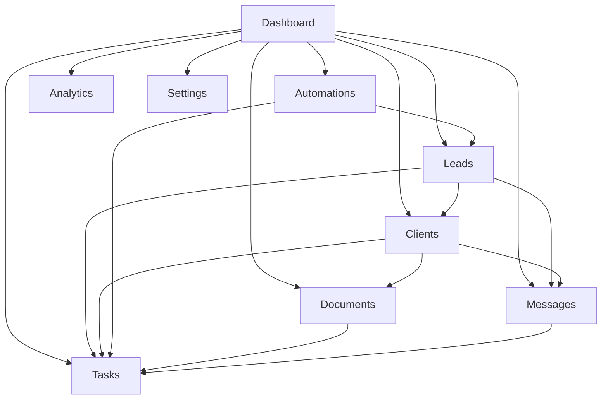

# Columbus AI Admin Portal

**Status:** Foundational product definition  
**Last updated:** June 2026  
**Primary reference:** [First Sellable Product](./first-sellable-product.md)

---

## Purpose

This document defines the complete Columbus AI Admin Portal experience.

It answers a single practical question:

**If I am a business owner logging into Columbus AI to run my business, what do I need to see, know, and do immediately?**

The Admin Portal is the operational control center of the business. It is where the owner or operator monitors new opportunities, works through client obligations, manages tasks, resolves blockers, and stays ahead of service delivery.

This document should guide:

- Dashboard design
- Admin navigation and information architecture
- CRM and lead management decisions
- Workflow and automation visibility
- Notification design
- Future Cursor implementation work

This document must remain aligned with [First Sellable Product](./first-sellable-product.md) and must not introduce conflicting concepts, modules, or MVP scope.

---

## Core Design Philosophy

The admin portal is **not** a reporting tool.

The admin portal is an **operations center**.

Every screen should answer:

> **What requires my attention right now?**

That principle should govern every design decision:

- A widget exists only if it helps the owner decide or act.
- A metric exists only if it reveals urgency, risk, or momentum.
- A notification exists only if it changes behavior.
- A page exists only if it supports acquire, onboard, serve, or retain.

The admin portal should prioritize:

1. Immediate visibility over historical analysis
2. Clear next actions over passive reporting
3. Operational flow over software category boundaries
4. Exception handling over status browsing
5. Mobile-friendly triage over dense desktop-only interfaces

In MVP, the portal should make it easy to answer:

- Which leads need follow-up?
- Which clients are blocked?
- Which tasks are overdue?
- Which documents are missing?
- Which automations failed?
- What should I do next?

---

## Primary Navigation

The admin portal should use the following primary navigation:

1. Dashboard
2. Leads
3. Clients
4. Tasks
5. Documents
6. Messages
7. Automations
8. Analytics
9. Settings

Each section below defines why it exists and how it connects to the rest of the system.

---

## Dashboard

**Purpose:** Provide immediate visibility into business operations and surface the highest-priority actions across the business.

**Primary user goals:**

- See what changed since last login
- Identify urgent leads, clients, tasks, and failures
- Jump directly into work
- Confirm whether the business is operationally healthy

**Required data:**

- New leads and follow-up state
- Tasks and due dates
- Active client counts and client status
- Recent activity across CRM, portal, and automations
- Unread messages / open conversations
- Outstanding document requests
- Pipeline summary
- Upcoming appointments
- Automation alerts and failure state

**Key actions:**

- Open a lead that requires follow-up
- Open the Tasks page with overdue filter applied
- Open a client record from an alert
- Resolve automation failures or retry workflows
- Review recent activity for context

**Relationships to other modules:**

- Pulls summary information from all operational modules
- Should deep-link into Leads, Clients, Tasks, Documents, Messages, and Automations
- Must not become a duplicate analytics/reporting page

### Dashboard Specification

The dashboard is the owner's home screen and daily command center. It should load with a clear default ordering:

1. Attention-required widgets
2. Workflow health widgets
3. Business movement widgets
4. Recent context widgets

### Required Widgets

#### New Leads

**Purpose:** Show newly captured opportunities that entered the system and may need review.

**Data source:**

- `sales.leads`
- Lead source metadata
- Created timestamp

**User actions:**

- Open lead detail
- Assign owner
- Mark as contacted
- Start qualification workflow

**Success criteria:**

- Owner can identify all new leads in under 5 seconds
- No new lead waits unseen because it was buried in email

#### Leads Requiring Follow-Up

**Purpose:** Surface leads that are overdue or coming due for human action.

**Data source:**

- Lead status
- `followup_count`
- `next_followup_at`
- Last communication timestamp

**User actions:**

- Open lead
- Log outreach
- Reschedule follow-up
- Change stage
- Disqualify or convert

**Success criteria:**

- Owner can instantly see which leads are at risk of being forgotten
- Follow-up work is driven from the system, not memory

#### Tasks Due Today

**Purpose:** Show work that must be completed today across onboarding, delivery, and admin operations.

**Data source:**

- Manual tasks
- Automation-generated tasks
- Due date and priority

**User actions:**

- Open task
- Mark complete
- Reassign
- Adjust due date or priority

**Success criteria:**

- Owner can see today's work without checking multiple pages
- Overdue work is visibly separated from on-track work

#### Active Clients

**Purpose:** Give a quick count and health snapshot of current client load.

**Data source:**

- `sales.clients`
- Portal client status
- Recent client activity

**User actions:**

- Open client list
- View clients with recent changes
- Inspect onboarding or blocked statuses

**Success criteria:**

- Owner understands current client volume and whether any accounts require attention

#### Recent Activity

**Purpose:** Provide timeline context across the system so the owner can understand what changed since the last login.

**Data source:**

- Lead status changes
- Client provisioning events
- Task completions
- Comments, document uploads, automation events

**User actions:**

- Open related record
- Filter by type
- Review chronology before taking action

**Success criteria:**

- Owner can reconstruct the latest operational context quickly

#### Unread Messages

**Purpose:** Surface conversations that need response.

**Data source:**

- Client-visible work item comments
- Future messaging inbox
- Notification state

**User actions:**

- Open conversation
- Reply
- Mark handled

**Success criteria:**

- No important client communication is missed
- Communication requiring response is visible without digging through external channels

#### Outstanding Documents

**Purpose:** Show documents that have been requested but not received or reviewed.

**Data source:**

- Document request records
- Upload state
- Review state

**User actions:**

- Open client record
- Send reminder
- Review upload
- Mark received / approved

**Success criteria:**

- Missing documents become a visible operational queue instead of hidden friction

#### Pipeline Overview

**Purpose:** Provide a quick operational view of sales movement through the lifecycle.

**Data source:**

- Lead stage counts
- Opportunity stage counts
- Conversion trend snapshot

**User actions:**

- Open Leads page with stage filter
- Open opportunities view
- Identify stage bottlenecks

**Success criteria:**

- Owner can see where deals are accumulating or stalling

#### Upcoming Appointments

**Purpose:** Show scheduled calls, meetings, and onboarding sessions that affect current operations.

**Data source:**

- Calendar integration or internal appointment records
- Lead and client associations

**User actions:**

- Open related lead/client
- Confirm prep notes
- Reschedule if needed

**Success criteria:**

- The owner is not surprised by the next operational commitment

#### Automation Alerts

**Purpose:** Surface workflow failures, paused sequences, and jobs requiring manual intervention.

**Data source:**

- n8n workflow status
- Error logs
- Failed execution summaries
- Alert thresholds

**User actions:**

- Open automations page
- Retry
- Acknowledge
- Investigate failure details

**Success criteria:**

- Failed automations are visible quickly enough to prevent lead loss or onboarding delays

---

## Leads

**Purpose:** Manage prospects from first contact through qualification, proposal, and conversion.

**Primary user goals:**

- Review new leads
- Move leads through stages
- Track follow-up and communication
- Decide who should be contacted, qualified, disqualified, or converted

**Required data:**

- Lead identity and source
- Stage and status
- Follow-up schedule
- Owner / assignee
- Notes and communication history
- Qualification details
- Proposal / opportunity state

**Key actions:**

- Create or import a lead
- Update stage
- Log outreach
- Add note
- Convert lead to opportunity
- Mark lost or archive

**Relationships to other modules:**

- Feeds Dashboard widgets
- Converts into Clients
- Generates Tasks and Automations
- Connects to Messages for communication history
- Supplies Analytics for funnel measurement

### Lead Page Specification

#### Lead Table

The default view should show:

- Name
- Company
- Source
- Stage
- Last activity
- Next follow-up
- Assigned owner
- Priority / urgency

#### Lead Stages

MVP stages should align to the lead lifecycle document:

- Lead Created
- Contacted
- Qualified
- Proposal Sent
- Won
- Lost
- Archived

#### Lead Detail Panel

The lead detail view should show:

- Core profile
- Qualification details
- Current stage
- Follow-up schedule
- Activity history
- Notes
- Communication history
- Related opportunity status
- Suggested next action

#### Activity History

Should include:

- Lead creation
- Stage transitions
- Follow-up sends
- Calls / email attempts logged
- Notes added
- Proposal sent
- Conversion / loss event

#### Notes

Notes should capture:

- Qualification observations
- Fit / objections
- Commitments made
- Next-step context

#### Communication History

At MVP, this can begin with:

- Follow-up events
- Work-item-style comments where relevant
- Logged calls or manual outreach summaries

Post-MVP, this can expand to unified channel sync.

#### Lead Actions

Required actions:

- Mark contacted
- Qualify / disqualify
- Add note
- Schedule follow-up
- Convert to opportunity
- Mark won / lost

#### Required Filters

- Stage
- Source
- Assigned owner
- Follow-up due / overdue
- Date created
- Last activity
- Won / lost / archived state

#### Required Metrics

- New leads today / week
- Leads overdue for follow-up
- Stage conversion counts
- Average time to first contact
- Lead velocity through pipeline

---

## Clients

**Purpose:** Manage active clients once a lead has converted and ensure service delivery stays visible.

**Primary user goals:**

- See all active clients
- Identify which clients are blocked or at risk
- Manage onboarding progress
- Review tasks, documents, and message history in one place

**Required data:**

- Client profile and owner
- CRM and portal IDs
- Onboarding status
- Open tasks
- Documents requested / missing
- Message history
- Timeline of service activity

**Key actions:**

- View client profile
- Review onboarding progress
- Open requests or tasks
- Request documents
- Send message or add note
- Retry provisioning if needed

**Relationships to other modules:**

- Created from Leads / opportunities
- Linked to Tasks, Documents, Messages, and Automations
- Supplies Dashboard urgency widgets
- Feeds Analytics for client growth and retention

### Client Page Specification

#### Client List

Should show:

- Client name
- Status
- Onboarding state
- Open tasks count
- Missing documents count
- Last activity
- Assigned owner

#### Client Profile

Should include:

- Core business/contact info
- Lifecycle state
- Linked portal workspace
- Services / package context
- Internal notes

#### Onboarding Status

Should show:

- Not started
- In progress
- Waiting on client
- Completed
- Blocked

#### Tasks

Client detail should surface:

- Open work items
- Overdue tasks
- Priority tasks
- Who owns each next step

#### Documents

Client detail should show:

- Requested documents
- Uploaded documents
- Missing items
- Review status

#### Messages

Client detail should show:

- Open conversations
- Last inbound / outbound message
- Internal notes relevant to service delivery

#### Timeline

Should unify:

- Conversion event
- Provisioning event
- Onboarding milestones
- Task updates
- Document events
- Important communication events

#### Required Actions

- Open onboarding checklist
- Create task
- Request document
- Add note
- Open message thread
- Resolve provisioning issue

---

## Tasks

**Purpose:** Turn operational commitments into visible, trackable work.

**Primary user goals:**

- See what needs to be done
- Assign work
- Track due dates and completion
- Separate urgent work from background work

**Required data:**

- Title and description
- Related lead or client
- Assignee
- Priority
- Due date
- Status
- Source (manual vs automation-generated)

**Key actions:**

- Create task
- Assign owner
- Change due date
- Complete task
- Escalate or reprioritize

**Relationships to other modules:**

- Triggered by Leads, Clients, Documents, and Automations
- Appears on Dashboard
- Supports onboarding and retention workflows

### Task Page Specification

Should support:

- Manual task creation
- Assignment to owner / staff
- Due dates and overdue state
- Completion tracking
- Automation-generated tasks
- Priority levels: low, medium, high, critical

### Views

Required views:

- My tasks
- Due today
- Overdue
- By client
- By lead
- By priority
- Automation-generated only

---

## Documents

**Purpose:** Make document collection, review, and organization operationally visible.

**Primary user goals:**

- Request missing documents
- See what has been uploaded
- Review outstanding items
- Keep files organized by client and workflow

**Required data:**

- Client association
- Document type
- Request status
- Upload timestamp
- Review / approval state
- Owner / requester

**Key actions:**

- Create document request
- Upload file
- Review upload
- Mark approved or still needed
- Send reminder

**Relationships to other modules:**

- Tied to Clients and onboarding
- Feeds Dashboard outstanding documents widget
- May generate Tasks and Messages

### Document Page Specification

Should cover:

- Document requests
- Uploads
- Approvals / review
- Outstanding requests
- Document organization by client and category

---

## Messages

**Purpose:** Keep communication centralized around the operational work of serving leads and clients.

**Primary user goals:**

- Respond to clients
- Review communication history
- Preserve context
- Separate internal notes from client-visible conversations

**Required data:**

- Conversation participant(s)
- Related lead or client
- Message timeline
- Visibility (internal vs client-visible)
- Notification state

**Key actions:**

- Open conversation
- Reply
- Add internal note
- Mark handled
- Escalate for follow-up

**Relationships to other modules:**

- Linked to Leads, Clients, Tasks, and Documents
- Feeds Dashboard unread messages widget
- Supports service and retention workflows

### Message Page Specification

Should support:

- Client communications
- Internal notes
- Conversation history
- Notification handling

MVP should prioritize operational message threads tied to work items and client records, not a broad multi-channel inbox.

---

## Automations

**Purpose:** Give owners visibility into automated work happening on their behalf and expose failures before they cause business loss.

**Primary user goals:**

- Confirm workflows are running
- See failures and risks
- Understand what happens next automatically
- Trigger or retry workflows when appropriate

**Required data:**

- Workflow definitions
- Status (active, paused, failed)
- Execution history
- Failure summaries
- Upcoming scheduled actions
- Manual trigger availability

**Key actions:**

- View workflow status
- Retry failed execution
- Pause / resume (where allowed)
- Trigger a workflow manually
- Review execution history

**Relationships to other modules:**

- Supports Leads, Tasks, Clients, Documents, and Dashboard alerts
- Depends on n8n in MVP
- Supplies Analytics for automation effectiveness

### Automations Page Specification

Should show:

- Automation visibility
- Workflow status
- Execution history
- Failures
- Upcoming actions
- Manual triggers

The page should explain the operational effect of each workflow, not just technical metadata.

---

## Analytics

**Purpose:** Provide business performance visibility without replacing the dashboard's operational focus.

**Primary user goals:**

- Review trend lines and performance
- Understand whether operations are improving outcomes
- Spot bottlenecks over time

**Required data:**

- Lead volume
- Conversion rates
- Time to first contact
- Time to qualification
- Client growth
- Task completion trends
- Automation effectiveness

**Key actions:**

- Review conversion performance
- Identify funnel bottlenecks
- Compare periods
- Validate whether automations reduce admin work

**Relationships to other modules:**

- Reads from Leads, Clients, Tasks, Documents, and Automations
- Should not drive daily action as much as Dashboard does

### Recommended Metrics

- Conversion rate by source
- Lead velocity
- Time-to-contact
- Time-to-close
- Client growth
- Onboarding completion rate
- Automation success / failure rate

---

## Settings

**Purpose:** Manage the configuration needed to operate the system safely and consistently.

**Primary user goals:**

- Maintain business identity and configuration
- Manage users and permissions
- Configure integrations and notifications
- Control security-sensitive settings

**Required data:**

- Business profile
- User accounts and roles
- Integration status
- Notification preferences
- Branding settings
- Security and access state

**Key actions:**

- Update business settings
- Invite / manage users
- Configure integrations
- Adjust notifications
- Review branding
- Update security controls

**Relationships to other modules:**

- Supports every operational module
- Should remain mostly configuration-oriented, not daily workflow oriented

### Settings Areas

- Business settings
- Users
- Integrations
- Notifications
- Branding
- Security

---

## Cross-Module Relationships

The Admin Portal should feel like one connected operations system rather than separate tools.

Design implications:

- Every important widget should deep-link into an action page.
- Clients should be visible through work, not hidden behind profile pages.
- Tasks should be generated from real workflow events, not maintained as an isolated to-do list.
- Messages and documents should always have business context attached.

---

## Information Prioritization Rules

To keep the Admin Portal aligned with the first sellable product:

1. Show urgent work before aggregate metrics.
2. Show exceptions before healthy background state.
3. Show next action before historical detail.
4. Show workflow state before configuration controls.
5. Keep analytics secondary to operations.
6. Defer rich customization until standard workflows are proven.

Examples:

- A widget showing "8 leads in pipeline" is less valuable than "3 leads overdue for follow-up."
- A revenue chart is less important on the home screen than "2 onboarding clients are blocked on missing documents."
- A workflow list is less useful than "Demo follow-up automation failed for 4 leads today."

---

## MVP Scope Guidance

The Admin Portal MVP should focus on helping a small business owner:

- React to new leads
- Keep follow-up moving
- Convert qualified leads into clients
- Monitor onboarding status
- Track open work
- Resolve missing documents
- Catch automation failures early

The Admin Portal MVP should **not** attempt to be:

- A full BI platform
- A customizable enterprise operations suite
- A white-label admin framework
- A workflow-builder UI
- A complex team-management system

Those may be future capabilities, but they should not shape the initial portal experience.

---

## Admin Portal Success Definition

A business owner should be able to log in and know within **30 seconds**:

- What needs attention
- Which leads require action
- Which clients require action
- Which tasks are overdue
- Which documents are missing
- Which automations failed

If the portal cannot answer those questions quickly, it is not serving its primary purpose.

---

## Related Documentation

- [First Sellable Product](./first-sellable-product.md)
- [Client onboarding](./onboarding.md)
- [Lead lifecycle](../workflows/lead-lifecycle.md)
- [Demo request workflow](../workflows/demo-request-workflow.md)
- [Follow-up workflow](../workflows/follow-up-workflow.md)
- [System overview](../architecture/system-overview.md)
