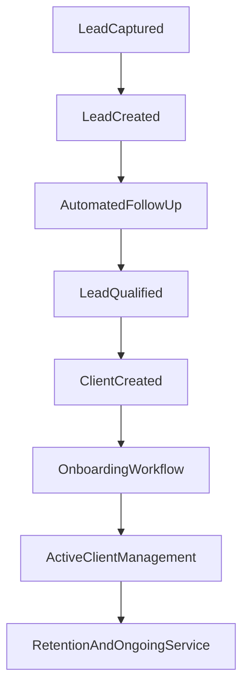

# Columbus AI Client Operations System

**Status:** Living document — primary source of truth for product, architecture, workflow, and feature decisions  
**Last updated:** June 2026

---

## Purpose

This document defines exactly what Columbus AI is selling before additional features are built.

The goal is to prevent feature creep and ensure all future development supports a clear business outcome. Use this document when deciding what to build, what to defer, and how to prioritize work in Cursor sessions, planning, and architecture reviews.

This document should answer:

- What are we selling?
- Who are we selling it to?
- What problem are we solving?
- What outcome are customers paying for?
- What belongs in MVP?
- What does not belong in MVP?

For high-level principles and module overview, see [Product Vision](../vision/product-vision.md). For technical implementation details, see [Related documentation](#related-documentation) at the end of this document.

---

## Product Summary

Columbus AI provides a **Client Operations System** for small service businesses.

The platform helps businesses:

- Capture leads from their website and marketing channels
- Automate follow-up so prospects are not lost to delay or inconsistency
- Convert qualified prospects into paying clients
- Onboard new clients with structured checklists and clear next steps
- Manage ongoing client relationships in one place
- Reduce administrative work that pulls owners away from delivery and growth

The focus is **operational efficiency and client management** — not selling software categories (CRM, portal, dashboard) as ends in themselves. Customers buy outcomes: more conversions, less chaos, and better client experience.

Columbus AI is sold and delivered as a managed service: setup, hosting, maintenance, updates, and support are part of the offer (see [Pricing Philosophy](#pricing-philosophy)).

---

## Target Customer Profile

### Primary Audience

Small service businesses with approximately **1–25 employees**.

These businesses typically have a owner-operator or small team handling sales, delivery, and admin simultaneously. They do not have dedicated RevOps staff, full-time IT, or enterprise software budgets. They need a system that works out of the box and reduces daily operational friction.

### Examples

- Estheticians and med spas
- Recovery housing operators
- Consultants and coaches
- Marketing and service agencies
- Home service providers (HVAC, cleaning, landscaping)
- Professional services (accountants, bookkeepers, legal support)

### Common Pain Points

| Pain point | What it looks like day to day |
|------------|-------------------------------|
| **Missed leads** | Form submissions sit in email; no one follows up same day |
| **Inconsistent follow-up** | Owner remembers to call some leads; others go cold |
| **Disorganized communication** | Texts, email, and DMs scattered; context lost between channels |
| **Manual onboarding** | New clients get ad-hoc emails; steps are forgotten or repeated |
| **Scattered documents** | Contracts and intake forms live in email attachments or Google Drive folders with no link to the client record |
| **Lack of visibility** | Owner cannot answer "Who needs attention today?" without digging through inboxes |

Columbus AI addresses these pains through a single operational workflow: capture → follow up → qualify → convert → onboard → serve → retain.

---

## Customer Outcomes

Customers are **not** buying labels. They are buying measurable improvements to how their business runs.

### Customers Are NOT Buying

| What they say they might want | Why it is not the product |
|------------------------------|---------------------------|
| A CRM | CRM is a tool category; they want more closed deals and less dropped follow-up |
| A dashboard | Dashboards alone do not change behavior; they want to know what requires action now |
| An AI chatbot | Chat is a channel; they want faster response and qualified conversations |
| A client portal | Portals are access; they want clients to self-serve onboarding and stay informed |

### Customers ARE Buying

| Outcome | Example |
|---------|---------|
| **More lead conversions** | A med spa converts 3 of 10 demo requests instead of 1 because every lead gets a timed follow-up sequence |
| **Faster follow-up** | First touch happens within minutes via automated email; owner gets notified only when human action is needed |
| **Better organization** | Every lead, client, task, and document is tied to one record — no searching email for "that contract" |
| **Less administrative work** | Onboarding checklist auto-creates portal tasks; owner spends 30 minutes less per new client on admin |
| **Improved client experience** | Clients see status, complete onboarding steps, and upload documents without chasing the owner on text |
| **Greater operational visibility** | Owner opens admin dashboard and immediately sees: new leads, follow-ups due, clients stuck in onboarding, outstanding documents |

Every MVP feature must trace back to at least one of these outcomes.

---

## Core Product Workflow

The ideal end-to-end workflow for Columbus AI's first sellable product:

Technical references: [Demo request workflow](../workflows/demo-request-workflow.md), [Follow-up workflow](../workflows/follow-up-workflow.md), [Client onboarding](../product/onboarding.md).

---

### 1. Lead Captured

**Objective:** No inbound interest is lost because it never entered the system.

**Automation opportunities:**

- Website contact / demo form submits directly to Columbus API
- Optional n8n webhook for confirmation email and internal notification
- Auto-assign lead source and timestamp

**Required data:**

- Name, email (minimum)
- Optional: phone, company, service interest, message

**User actions:**

- Business owner ensures form is live on marketing site
- Owner reviews new lead notification (admin dashboard or email)

**Repo anchor:** Marketing `ContactSection` → `POST /api/leads/demo`

---

### 2. Lead Created

**Objective:** Every captured lead becomes a persistent record with a defined status and next step.

**Automation opportunities:**

- Create `sales.leads` record on submit
- Set initial status (`new`) and schedule first follow-up (`next_followup_at`)
- Log activity event for audit trail

**Required data:**

- Lead identity fields
- Status, `followup_count`, `next_followup_at`
- Source (e.g. demo form, referral)

**User actions:**

- None required if automation is configured
- Admin may manually add or edit leads for phone/walk-in inquiries

**Repo anchor:** `@columbusai/leads` `processDemoLead` → Postgres `sales.leads`

---

### 3. Automated Follow-Up

**Objective:** Prospects receive timely, consistent outreach without the owner manually sending every email.

**Automation opportunities:**

- Scheduled n8n workflow polls due leads and sends follow-up emails
- Increment `followup_count`; reschedule or stop based on status
- Include booking link (Cal) in follow-up copy
- Stop sequence when lead is qualified, disqualified, or converted

**Required data:**

- Lead email, status, `followup_count`, `next_followup_at`
- Email templates / objectives per touch
- `BOOKING_LINK` and n8n workflow configuration

**User actions:**

- Owner responds when lead replies or books a call
- Admin may change lead status to pause automation

**Repo anchor:** [Follow-up workflow](../workflows/follow-up-workflow.md) — n8n schedule every 15 minutes

---

### 4. Lead Qualified

**Objective:** Separate serious prospects from noise; prepare for conversion to client.

**Automation opportunities:**

- Status change triggers stop of demo follow-up sequence
- Convert lead to opportunity (pipeline stage)
- Optional task creation for owner ("Schedule discovery call")
- Activity log on status change

**Required data:**

- Lead/opportunity status (e.g. `qualified`, `disqualified`)
- Notes, last contact date
- Opportunity value / stage (MVP: basic stages)

**User actions:**

- Owner or staff reviews lead, adds notes, moves to qualified or disqualified
- Owner schedules call or sends proposal outside system (MVP) or via linked booking

**Repo anchor:** Admin lead/opportunity status via `PATCH /api/leads/:id/status`, convert to opportunity

---

### 5. Client Created

**Objective:** Won opportunity becomes an operational client with portal access and CRM record.

**Automation opportunities:**

- Single orchestrated conversion: CRM client + portal tenant + auth user + onboarding work items
- Welcome notification to client and agency
- Stop any remaining lead follow-up by email
- Optional `ONBOARDING_WEBHOOK_URL` for n8n / external automation

**Required data:**

- Opportunity/client contact email, company name
- Stack template selection (recorded for ops handoff)
- Portal client ID, auth membership

**User actions:**

- Admin converts opportunity (manual button or Kanban drag to Won)
- Admin retries provisioning if conversion fails

**Repo anchor:** [Client onboarding](../product/onboarding.md) — `POST /api/opportunities/:id/convert-to-client`

---

### 6. Onboarding Workflow

**Objective:** New clients know exactly what to do; owner knows onboarding progress without chasing.

**Automation opportunities:**

- Auto-create onboarding checklist work items in portal
- Send welcome notification with portal login instructions
- Remind client of incomplete onboarding tasks (MVP target)
- Webhook to n8n for extended onboarding sequences (optional)

**Required data:**

- Onboarding task list (title, description, type, priority)
- Client portal user linked to `auth.client_users`
- Completion status per work item

**User actions:**

- Client logs into portal, completes onboarding tasks, uploads requested documents
- Agency staff monitors provisioning queue and assists blocked clients

**Repo anchor:** `portal.work_items`, `portal.notifications` created at conversion

---

### 7. Active Client Management

**Objective:** Ongoing service delivery is trackable; clients and agency share one source of truth for requests and status.

**Automation opportunities:**

- Client submits requests via Work Center; agency receives notifications
- Status changes trigger client notifications
- Internal vs client-visible comments on work items
- Task assignment and priority updates

**Required data:**

- Work items: title, type, status, priority, client ID
- Comments, attachments, activity timeline
- Agency and client user roles

**User actions:**

- Client creates requests, responds to questions, uploads files
- Agency updates status, adds internal notes, completes work items

**Repo anchor:** Portal Work Center (`/api/portal/work-items`), admin client detail views

---

### 8. Retention and Ongoing Service

**Objective:** Clients stay engaged; business reduces churn from neglect or poor communication.

**Automation opportunities:**

- Periodic check-in reminders (MVP target: simple scheduled tasks)
- Document request tracking until complete
- Re-engagement for inactive clients (post-MVP sequences)
- Satisfaction or review prompts after project completion

**Required data:**

- Client last activity date
- Open work items and document requests
- Service history / completed onboarding date

**User actions:**

- Owner reviews clients with no recent activity
- Agency proactively closes loops on open requests and document gaps

**Repo anchor:** MVP target — extend Work Center, documents, and messaging modules; not fully productized yet

---

## Core MVP Modules

Each module below is **in scope** for the first sellable product. Features listed are minimum viable — not exhaustive wish lists.

### CRM

**Purpose:** Manage leads and clients as the single record of who the business is talking to and serving.

**Core features:**

- Lead records with contact info and source
- Client records linked to portal tenant
- Status tracking (lead → opportunity → client lifecycle)
- Notes and basic activity history

**Guiding principle:** One record per person/company through the full lifecycle — no duplicate spreadsheets.

---

### Lead Management

**Purpose:** Track prospects through the sales pipeline until they convert or are disqualified.

**Core features:**

- Lead stages (e.g. new, contacted, qualified, disqualified)
- Activity history (status changes, follow-ups sent)
- Follow-up tracking (`followup_count`, `next_followup_at`, due indicators)
- Convert lead to opportunity

**Guiding principle:** Owner always knows which leads need action today.

---

### Automations

**Purpose:** Reduce manual, repetitive work in follow-up, onboarding, and status updates.

**Core features:**

- Follow-up email sequences (demo lead nurture)
- Reminder workflows for overdue follow-ups and onboarding tasks
- Status-driven automation (stop follow-up when qualified; trigger onboarding on conversion)
- Task creation on key events (conversion, document request)

**Guiding principle:** Automate the predictable; surface exceptions to humans.

**Technical note:** MVP uses n8n for workflow execution; in-app workflow builder is out of scope (see [What Does NOT Belong In MVP](#what-does-not-belong-in-mvp)).

---

### Client Portal

**Purpose:** Give clients visibility into their relationship with the business and a place to complete onboarding and ongoing requests.

**Core features:**

- View status of requests and onboarding tasks
- Upload documents when requested
- Complete onboarding checklist items
- Send messages / comments on work items (client-visible thread)

**Guiding principle:** Clients should not need to email the owner for "what's the status?"

---

### Admin Dashboard

**Purpose:** Give business owners immediate visibility into what requires attention across leads, clients, and operations.

**Core widgets (MVP):**

- New leads (today / this week)
- Follow-ups due (overdue and upcoming)
- Active clients count and recent activity
- Outstanding documents (requested but not received)
- Tasks / work items requiring attention

**Guiding principle:** Every dashboard component must answer:

> **"What requires attention right now?"**

If a widget does not drive a decision or action today, it does not belong on the MVP dashboard.

---

### Documents

**Purpose:** Centralize client files so contracts, intake forms, and deliverables are organized and requestable.

**Core features:**

- Upload (client and agency)
- Storage tied to client record
- Organization by category or request (e.g. contract, intake, invoice)
- Request tracking (requested → uploaded → reviewed)

**Guiding principle:** No more "can you resend that form?" because the file lives on the client record.

---

### Messaging

**Purpose:** Keep client communication centralized and auditable alongside work items and client history.

**Core features:**

- Client-visible conversations on work items / requests
- Internal notes visible only to agency staff
- Activity history (status changes, comments, uploads) in one timeline

**Guiding principle:** Context travels with the client — not trapped in personal inboxes.

**MVP scope note:** Unified inbox across all channels (SMS, email sync) is post-MVP; MVP focuses on in-platform threads tied to work items.

---

## What Does NOT Belong In MVP

The following are **future considerations**, not launch requirements. Building them before the core workflow is sellable delays revenue and dilutes focus.

| Deferred capability | Why it waits |
|--------------------|--------------|
| **Marketplace functionality** | Not needed to deliver client operations for first customers |
| **Billing systems** | Invoicing and payments can be handled externally at launch |
| **Advanced AI agents** | AI assists workflows later; MVP prioritizes visibility and automation of known steps |
| **Custom workflow builders** | n8n + predefined sequences suffice for MVP; self-serve builder adds complexity |
| **Multi-tenant enterprise features** | First customers are single-business deployments |
| **White-label support** | Columbus AI branded delivery for launch |
| **Team hierarchy complexity** | Basic roles (owner/staff/client) sufficient; deep org charts defer |
| **Mobile-native apps** | Responsive web is MVP; App Store / Play Store apps defer |
| **Advanced analytics / revenue dashboards** | Operational widgets first; BI later |
| **Automated infrastructure provisioning** | Stack templates recorded; Hostinger deploy remains manual ops (see onboarding Phase 4) |

Aligned deferred technical work documented in [Client onboarding — Phase 4](../product/onboarding.md):

- Hostinger DNS / deploy automation
- n8n onboarding checklist workflow (webhook subscriber)
- Stripe / billing bridge on `automation.Client`
- Persisted workspace/environment tables (replace admin mock platform data)

**Rule:** If a feature is on this list, do not prioritize it until MVP workflow is sellable and at least one paying customer is live.

---

## Product Design Principles

1. **Simple before powerful**  
   Ship the smallest version that delivers the outcome. Add power only when the simple path is proven and requested.

2. **Automation before manual work**  
   If a step happens the same way every time, automate it. Reserve human time for judgment, relationships, and exceptions.

3. **Visibility before complexity**  
   Owners must see what needs attention before they get filters, reports, or configuration options.

4. **Mobile-first usability**  
   Owners and clients check status on phones. Layouts, touch targets, and critical actions must work on mobile web without a native app.

5. **Business outcomes over features**  
   Every screen and API endpoint should map to acquire, onboard, serve, or retain. Feature lists are not success criteria.

6. **Every feature must support acquire, onboard, serve, or retain**  
   If it does not move a lead forward, onboard a client, deliver service, or reduce churn — question whether it belongs in MVP.

---

## Pricing Philosophy

Columbus AI is sold as a **managed Client Operations System**, not self-serve SaaS at launch.

### Launch Package (indicative)

| Component | Range |
|-----------|-------|
| **Setup fee** | $1,000 – $2,500 |
| **Monthly service** | $199 – $499 / month |

### Monthly service includes

- Hosting (VPS, Docker, TLS)
- Maintenance and security updates
- Platform updates and bug fixes
- Support for operational issues (not unlimited custom development)

Setup covers initial configuration: branding alignment, form integration, follow-up sequences, portal provisioning for first clients, and owner training.

**Pricing may evolve** as scope, customer size, and automation depth are validated with early customers. This document captures launch intent, not a final price list.

---

## Success Metrics

Define success by **customer outcomes**, not feature count.

| Metric | What good looks like | Example measurement |
|--------|----------------------|---------------------|
| **Lead response time** | First automated touch within minutes; human follow-up within 24h | Time from `sales.leads.created_at` to first follow-up email sent |
| **Follow-up completion rate** | Most new leads receive full sequence unless disqualified | % of `new` leads with `followup_count` reaching planned touches |
| **Onboarding completion rate** | New clients finish onboarding checklist within agreed window | % of onboarding work items completed within 14 days of conversion |
| **Administrative time reduced** | Owner reports fewer hours on email chasing and spreadsheet updates | Owner time survey or weekly hours logged on admin tasks (baseline vs after) |
| **Client satisfaction** | Clients report clarity and responsiveness | Post-onboarding NPS or simple 1–5 satisfaction prompt in portal |

Track metrics per customer deployment during pilot; aggregate patterns inform product iteration and pricing.

---

## Feature Evaluation Framework

Before building any feature, ask:

1. Does this help **acquire** clients (more leads, better conversion)?
2. Does this help **onboard** clients (faster, clearer, fewer drop-offs)?
3. Does this help **serve** clients (delivery, requests, communication)?
4. Does this help **retain** clients (ongoing engagement, reduced churn)?
5. Does this **reduce manual work** for the business owner or staff?
6. Does this **increase operational visibility** (what needs attention now)?

**Decision rule:** If the answer is **no** to most of these questions, the feature likely does **not** belong in MVP. Defer it or reject it explicitly.

Use this framework in PR descriptions, Cursor prompts, and roadmap grooming. Link back to [What Does NOT Belong In MVP](#what-does-not-belong-in-mvp) when deferring.

---

## Current Implementation Status

**Purpose:** Provide context on what is already implemented in the repository so future planning and development can build on existing work rather than recreating it.

Statuses: **Implemented** · **Partial** · **Planned** · **Deferred**

---

### Infrastructure

**Status:** Implemented

- Monorepo structure established (`apps/marketing`, `portal`, `admin`, `api`; `packages/db`, `leads`)
- Docker Compose dev, staging, and production stacks operational
- Traefik configured for TLS and subdomain routing
- PostgreSQL configured (unified pgvector instance: `columbus`, `columbus_vectors`, `n8n`)
- Production VPS deployed (Hostinger) with deployment runbook
- CI/CD operational (typecheck, lint, test, smoke verification)

See [Deployment](../architecture/deployment.md), [Environment](../architecture/environment.md), [Foundation v1](../roadmap/foundation-v1.md).

---

### CRM

**Status:** Partial

**Implemented:**

- Postgres schemas: `sales.leads`, opportunities, clients
- Admin API: list/get/patch leads, opportunities, clients; convert lead to opportunity; convert opportunity to client
- Admin UI: leads pipeline, opportunities, client list and detail views
- Session-based admin auth (Supabase frozen; Postgres `auth` schema)

**Not implemented:**

- Production-polished unified CRM UX (notes, activity feed as first-class product)
- Full sellable CRM experience for non-technical owners without ops support
- Document and messaging integration on client record

---

### Lead Management

**Status:** Partial

**Implemented:**

- Lead capture via marketing demo form → `POST /api/leads/demo`
- Lead storage in `sales.leads` with status and follow-up scheduling
- n8n demo-request workflow (confirmation / AI email on capture)
- n8n scheduled follow-up workflow (2-touch discovery call sequence)
- Admin lead pipeline UI and status updates
- Lead → opportunity conversion API

**Not implemented:**

- Full CRM pipeline UX polished for daily owner use without training
- Lead dashboard widgets wired to live "attention now" metrics
- Opportunity tracking as complete sales product (forecasting, reporting)
- Multi-sequence template selection in admin UI (2-day / 7-day / 14-day templates exist as generated JSON only)

See [Demo request workflow](../workflows/demo-request-workflow.md), [Follow-up workflow](../workflows/follow-up-workflow.md).

---

### Client Portal

**Status:** Partial

**Implemented:**

- Portal auth (API sessions + `auth.client_users`)
- Work Center: list, create, detail work items with status, priority, comments
- Attachments and activity timeline on work items (API-backed)
- Notifications (list, mark read)
- Onboarding work items created automatically on client conversion
- Agency admin work views (`/admin/work`)
- Responsive layout shell with sidebar navigation

**Not implemented:**

- Production-ready experience for all sidebar pages (many routes are mock or placeholder)
- Documents module (real upload/storage — see Documents below)
- Unified messaging product beyond work-item comments
- Billing, analytics, automations, integrations pages as sellable features

---

### Admin Portal

**Status:** Partial

**Implemented:**

- Dashboard with KPIs, lead pipeline, clients table, workflow monitoring sections
- Sales: leads, opportunities, conversations list
- Clients and provisioning views (status, retry provision)
- Session login; RBAC (SUPER_ADMIN, ADMIN, STAFF, VIEWER)
- Command palette and sidebar navigation

**Not implemented:**

- MVP-focused dashboard answering only "what requires attention now" (current dashboard includes out-of-MVP sections: AI agents, analytics, revenue)
- Production workflow management inside admin (workflows live in n8n)
- Provisioning automation (queue, domains, secrets largely scaffold / mock)
- Sellable admin experience without distinguishing scaffold from live data

---

### Documents

**Status:** Planned

**Implemented:**

- Portal `/documents` route with UI shell (upload dialog, grouped list)

**Not implemented:**

- Real file storage tied to client records
- Agency document request workflow
- Request tracking (requested → uploaded → reviewed)
- Integration with onboarding checklist

Portal documents page currently uses mock data only.

---

### Messaging

**Status:** Partial

**Implemented:**

- Work item comment threads (client-visible vs internal visibility)
- Admin sales conversations UI (list/view)
- Activity timeline on work items

**Not implemented:**

- Unified client messaging inbox
- Email/SMS channel sync
- Standalone messaging module as defined in MVP (separate from work items)
- Message-driven automations

---

### Automations

**Status:** Partial

**Implemented:**

- n8n workflow sync tooling (`pnpm n8n:*` scripts)
- Demo request workflow (webhook on lead capture)
- Follow-up workflow (15-minute schedule, Postgres poll)
- Follow-up template generator (2-day / 7-day / 14-day JSON from TypeScript registry)
- Optional onboarding webhook on client provision

**Not implemented:**

- Production workflow engine integrated inside Columbus admin UI
- Onboarding checklist n8n workflow (subscribed to conversion event)
- In-app automation configuration for business owners
- Reminder workflows for overdue onboarding tasks (MVP target)

See [n8n workflow sync](../architecture/n8n-workflow-sync.md), [n8n local dev](../architecture/n8n-local-dev.md).

---

### Billing

**Status:** Deferred

- Not part of MVP
- Admin `/admin/billing` and portal `/billing` routes exist as placeholders only
- Stripe / `automation.Client` billing bridge explicitly deferred (onboarding Phase 4)

---

### Mobile Applications

**Status:** Deferred

- Not part of MVP
- Responsive web only; no iOS or Android native apps planned for first sellable product

---

## Related Documentation

| Document | Purpose |
|----------|---------|
| [Product Vision](../vision/product-vision.md) | High-level principles, modules, success definition |
| [Client onboarding](../product/onboarding.md) | Convert opportunity → portal tenant; stack templates; Phase 4 deferrals |
| [Demo request workflow](../workflows/demo-request-workflow.md) | Lead capture API and n8n demo webhook |
| [Follow-up workflow](../workflows/follow-up-workflow.md) | Scheduled discovery-call follow-up |
| [Follow-up templates](../workflows/follow-up-templates.md) | 2-day / 7-day / 14-day template sequences |
| [Deployment](../architecture/deployment.md) | Production VPS, Traefik, DNS, verification |
| [Environment](../architecture/environment.md) | `.env.local` / staging / production model |
| [Local development](../architecture/local-development.md) | Canonical dev workflow (`make up`, smoke) |
| [Auth consolidation](../architecture/auth-consolidation.md) | Postgres auth; Supabase frozen |
| [Postgres](../architecture/postgres.md) | Database layout and migrations |
| [Foundation v1](../roadmap/foundation-v1.md) | First foundation release scope |

When implementing features, start here for **what** and **why**, then follow linked docs for **how**.
