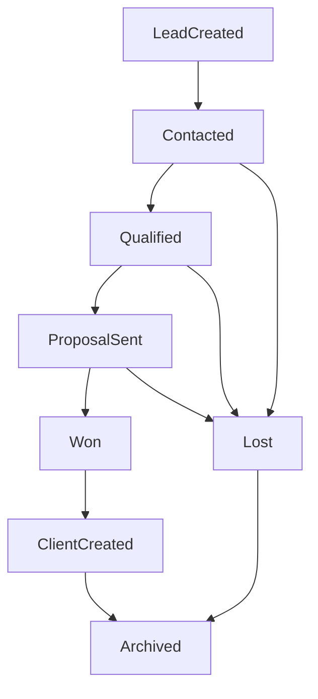

# Lead Lifecycle

**Status:** Foundational workflow definition  
**Last updated:** June 2026  
**Primary reference:** [First Sellable Product](../product/first-sellable-product.md)

---

## Purpose

This document defines the complete lifecycle of a lead from initial contact through active client.

This is one of the most important workflows in the Columbus AI platform. CRM behavior, automations, dashboard widgets, tasks, messaging, notifications, and reporting should all reference this workflow.

The objective is to create a shared operational model so:

- No lead is forgotten
- No follow-up is missed
- Qualification happens consistently
- Conversion to client is visible and structured
- Lost opportunities remain measurable
- Future Cursor sessions build on one source of truth

This workflow must remain aligned with [First Sellable Product](../product/first-sellable-product.md), [Demo request workflow](./demo-request-workflow.md), [Follow-up workflow](./follow-up-workflow.md), and [Client onboarding](../product/onboarding.md).

---

## Lifecycle Overview

### Stage sequence

1. Lead Created
2. Contacted
3. Qualified
4. Proposal Sent
5. Won
6. Client Created
7. Lost
8. Archived

The stages are intentionally operational, not theoretical. Each stage should make it clear:

- What must be true to enter it
- What must happen to leave it
- Who owns the next action
- What the system should automate

---

## Lifecycle Design Principles

1. A lead must always have a visible current stage.
2. Each stage must imply a next action or clear waiting state.
3. Automation should handle reminders, timestamps, and routine progression support.
4. Human intervention should focus on judgment, qualification, proposal, and relationship management.
5. Dashboard visibility should emphasize leads at risk of being forgotten or delayed.
6. Lost and archived stages are important because they preserve reporting accuracy and future re-engagement opportunities.

---

## Lead Created

**Purpose:** Capture all inbound opportunities as structured records so they can enter the sales workflow immediately.

**Entry conditions:**

- A new inquiry is received from any supported source
- Required minimum identifying data exists to create a lead record

**Exit conditions:**

- First outreach attempt is made
- Lead moves to `Contacted`
- Or lead is marked invalid / spam and moved to `Lost` or `Archived` based on policy

**Required data:**

- Name
- Email or phone
- Lead source
- Created timestamp
- Initial status
- Assigned owner (optional in MVP, required operationally if team grows)

**User actions:**

- Review lead record for completeness
- Correct or enrich data
- Begin outreach if no automation covers first contact

**Automation opportunities:**

- Create lead record automatically from form submission
- Set source and timestamps
- Trigger confirmation email or internal notification
- Schedule first follow-up

**Notifications:**

- Internal owner / team alert for new lead
- Optional confirmation email to prospect

**Dashboard visibility:**

- Appears in `New Leads`
- Appears in `Leads Requiring Follow-Up` if human action is due

**Metrics:**

- Lead volume by day / week
- Lead source distribution
- Time from capture to first contact

### Possible entry paths

- Website contact form
- Demo request form
- Referral
- Manual entry by owner or staff
- CSV / spreadsheet import
- Social media inquiry copied into system
- Phone call entered manually
- Email inquiry entered manually or via future integration

**Current repo alignment:** Demo request form is the primary implemented path; additional paths are product requirements for the workflow model.

---

## Contacted

**Purpose:** Confirm that outreach has begun and the lead is now actively being worked.

**Entry conditions:**

- At least one outreach attempt has been made
- Or an automated follow-up sequence has begun and the lead is being actively nurtured

**Exit conditions:**

- Lead replies and meets qualification threshold → `Qualified`
- Lead does not fit or declines → `Lost`
- Lead remains in active outreach with next follow-up scheduled

**Required data:**

- Contact attempt timestamp
- Channel used (email, phone, text, meeting request)
- Current follow-up schedule
- Last contact result

**User actions:**

- Log communication attempts
- Review replies
- Continue follow-up
- Decide whether to qualify, keep nurturing, or mark lost

**Automation opportunities:**

- Schedule timed follow-ups
- Send sequence emails
- Stop automation when status changes
- Alert owner when no response after defined interval

**Notifications:**

- Reminder when follow-up becomes due
- Alert when a lead reply arrives
- Escalation when a lead is overdue for action

**Dashboard visibility:**

- Appears in `Leads Requiring Follow-Up`
- May appear in `Recent Activity`

**Metrics:**

- Time to first contact
- Follow-up completion rate
- Number of contact attempts per lead
- Response rate after first and second outreach

### Communication attempts

Operational examples:

- Introductory email
- Phone call attempt
- SMS or direct message
- Meeting link sent
- Follow-up reminder

### Response tracking

Track:

- Replied / not replied
- Positive / neutral / negative response
- Interested / not now / wrong fit

### Follow-up schedules

MVP should support:

- Automated sequence timing
- Manual reschedule when needed
- Clear overdue status

**Current repo alignment:** Demo follow-up automation is currently implemented through n8n and `sales.leads.next_followup_at`.

---

## Qualified

**Purpose:** Confirm that the lead is a plausible fit and worth advancing toward a proposal or sale.

**Entry conditions:**

- Lead has engaged
- Enough information exists to assess fit
- Owner or staff believes there is real conversion potential

**Exit conditions:**

- Proposal is prepared or sent → `Proposal Sent`
- Lead is determined not to be a fit → `Lost`
- Lead remains qualified while details are gathered

**Required data:**

- Business type
- Service need
- Budget range or buying capacity
- Timeline / urgency
- Fit notes
- Qualification rationale

**User actions:**

- Review fit
- Add notes
- Confirm service alignment
- Decide whether to advance or disqualify

**Automation opportunities:**

- Stop generic nurture automation
- Create qualification review task
- Generate proposal-prep checklist
- Notify owner when a lead meets qualification threshold

**Notifications:**

- Owner alert when a lead becomes qualified
- Reminder if qualified lead sits too long without proposal progress

**Dashboard visibility:**

- Appears in pipeline summary
- May appear in a `Qualified but no proposal sent` widget

**Metrics:**

- Qualification rate
- Time from creation to qualification
- Qualification rate by source

### Qualification criteria

Qualification should answer:

- Is this a business Columbus AI is designed to serve?
- Does the lead have a real operational problem to solve?
- Is there intent or urgency to move forward?
- Is the engagement commercially viable?

### Required information

Minimum qualification info:

- Business type
- Primary pain point
- Desired outcome
- Timeline
- Service fit

### Business fit

Strong-fit examples:

- Small service business
- Clear issue with lead follow-up, onboarding, visibility, or admin burden
- Operational problem Columbus AI directly addresses

Poor-fit examples:

- Enterprise procurement-heavy buyer
- One-off project unrelated to client operations
- Buyer seeking only a generic chatbot or unrelated custom software

### Opportunity scoring

MVP can support lightweight scoring using:

- Fit
- Urgency
- Decision readiness
- Budget confidence

Do not over-engineer scoring before core conversion workflow is proven.

---

## Proposal Sent

**Purpose:** Mark the point where a qualified lead has been presented with a commercial offer and now requires structured close follow-up.

**Entry conditions:**

- Lead is qualified
- Proposal, estimate, service package, or commercial offer is sent

**Exit conditions:**

- Lead accepts → `Won`
- Lead declines → `Lost`
- Proposal expires or goes stale and is moved to `Lost` or remains under active follow-up

**Required data:**

- Proposal sent timestamp
- Package or offer summary
- Commercial value
- Proposal owner
- Follow-up date

**User actions:**

- Send proposal
- Log proposal details
- Schedule check-in
- Handle objections or revisions

**Automation opportunities:**

- Create proposal follow-up task
- Send reminder if proposal has not been reviewed
- Alert owner when proposal has been idle too long

**Notifications:**

- Proposal sent confirmation to owner
- Follow-up reminder after defined window

**Dashboard visibility:**

- Appears in pipeline overview
- Appears in `Proposals awaiting follow-up` if configured

**Metrics:**

- Proposal-to-win rate
- Time from qualification to proposal
- Proposal aging

### Proposal workflow

Proposal workflow should include:

- Commercial offer creation
- Delivery to lead
- Confirmation of receipt
- Follow-up sequence or reminders

### Proposal tracking

Track:

- Sent date
- Expected decision date
- Current state: sent, reviewing, revising, accepted, declined

### Follow-up automation

MVP can support:

- Reminder tasks
- Owner alerts for stale proposals
- Future automated check-in sequences

---

## Won

**Purpose:** Represent the commercial decision point where a lead has agreed to become a client.

**Entry conditions:**

- Proposal accepted
- Verbal or written commitment received
- Owner decides to move forward with provisioning

**Exit conditions:**

- Client record and portal workspace created → `Client Created`

**Required data:**

- Acceptance timestamp
- Chosen service/package
- Primary contact details
- Internal owner
- Any onboarding prerequisites

**User actions:**

- Confirm sale
- Review onboarding requirements
- Trigger client creation

**Automation opportunities:**

- Stop sales follow-up automation
- Generate onboarding tasks
- Trigger welcome communication
- Notify internal team that onboarding can begin

**Notifications:**

- Internal win notification
- Optional celebration / alert for owner

**Dashboard visibility:**

- Appears in pipeline movement summary
- May increment `Won this week/month`

**Metrics:**

- Win rate
- Time to close
- Win rate by source

### Conversion event

The win event is the operational handoff from sales to onboarding.

### Required actions

- Confirm that core data is complete
- Trigger conversion to client
- Prepare onboarding work

### Automation triggers

- Provision client workspace
- Create client portal user
- Create onboarding work items
- Send welcome notification

---

## Client Created

**Purpose:** Mark the point where the won lead is now an operational client in the system.

**Entry conditions:**

- Lead or opportunity has been converted
- Client CRM record exists
- Portal tenant and auth membership are created

**Exit conditions:**

- Client proceeds through onboarding and enters active delivery lifecycle

**Required data:**

- Client record
- Portal client ID
- Primary contact user
- Onboarding task set
- Welcome notification state

**User actions:**

- Verify successful provisioning
- Review onboarding checklist
- Resolve any provisioning failure

**Automation opportunities:**

- Create onboarding tasks automatically
- Create notification records
- Trigger external onboarding webhook
- Generate follow-up tasks for onboarding progress

**Notifications:**

- Client welcome communication
- Internal provisioning success/failure notice

**Dashboard visibility:**

- Appears in onboarding and active client widgets
- Blocked provisioning should appear as urgent work

**Metrics:**

- Conversion-to-client rate
- Time from win to client creation
- Provisioning success rate

### Client record creation

Required outputs:

- CRM client record
- Portal workspace / tenant
- Auth membership

### Portal access

The client should receive access to:

- Work Center
- Onboarding tasks
- Notifications
- Future document and message workflows

### Onboarding tasks

At minimum:

- Welcome / intake completion
- Required documents
- Initial coordination items

### Document requests

Client creation should be able to trigger document collection workflows as part of onboarding.

### Welcome communication

The welcome message should explain:

- What happens next
- Where to log in
- What the client needs to complete

**Current repo alignment:** Implemented through conversion flow documented in [Client onboarding](../product/onboarding.md).

---

## Lost

**Purpose:** Preserve truth about opportunities that did not convert and make the reasons measurable.

**Entry conditions:**

- Lead declines
- Lead is a poor fit
- Lead stops responding and is closed out by policy
- Budget, timing, or scope no longer works

**Exit conditions:**

- Lead is either left visible for reporting or later moved to `Archived`

**Required data:**

- Lost date
- Loss reason
- Optional notes
- Re-engagement eligibility

**User actions:**

- Select loss reason
- Add context
- Decide whether to re-engage later

**Automation opportunities:**

- Stop follow-up automation
- Schedule future re-engagement reminder if appropriate
- Categorize lost reasons for reporting

**Notifications:**

- Generally no immediate client-facing notification
- Internal summary may be useful for review

**Dashboard visibility:**

- Not typically shown as urgent work unless re-engagement is scheduled
- Included in analytics and loss-reason reporting

**Metrics:**

- Loss rate
- Loss reasons
- Lost by source
- Lost by stage

### Loss reasons

Recommended standard reasons:

- No response
- Wrong fit
- Budget
- Timing
- Chose competitor
- Internal priority changed
- Duplicate / invalid

### Re-engagement opportunities

Not all lost leads are dead. Some should be marked eligible for:

- Future campaign
- Future manual outreach
- Check-in after timing window

### Future marketing

Lost-lead segments should support future campaigns, but that is secondary to accurate operational closeout.

---

## Archived

**Purpose:** Remove inactive records from active working views while preserving history and reporting integrity.

**Entry conditions:**

- Lead is lost and no further action is planned
- Lead is stale and explicitly closed
- Client-created record has aged out of sales workflow relevance

**Exit conditions:**

- Rarely exits; restoration should be explicit if the opportunity returns

**Required data:**

- Archive timestamp
- Prior lifecycle stage
- Archive reason

**User actions:**

- Archive record
- Restore if it becomes active again

**Automation opportunities:**

- Auto-archive after defined inactivity policy
- Remove archived records from operational queues

**Notifications:**

- Usually none

**Dashboard visibility:**

- Archived records should not appear in active-action widgets
- Available only for filtered reporting and history

**Metrics:**

- Archive volume
- Time from lost to archive

---

## Automation Mapping

| Stage | Automation | Trigger | Outcome | Owner |
|-------|------------|---------|---------|-------|
| Lead Created | Lead record creation | Form submit / manual save | Lead stored with source and timestamps | API |
| Lead Created | Internal new lead alert | Lead creation | Owner knows a new lead exists | API / notification system |
| Contacted | Follow-up sequence | Lead remains `new` / active and follow-up becomes due | Outreach sent, next step scheduled | n8n |
| Contacted | Overdue reminder | Follow-up date passes without completion | Lead becomes visible as urgent | Dashboard / tasking |
| Qualified | Stop generic nurture | Status changes to `qualified` | No more generic follow-up emails | API / n8n |
| Qualified | Proposal prep task | Qualification confirmed | Owner prompted to send proposal | Tasks / automation |
| Proposal Sent | Proposal follow-up reminder | Proposal sent timestamp reaches threshold | Owner prompted to check in | Tasks / automation |
| Won | Sales sequence stop | Win confirmed | Prevent duplicate sales follow-up | API / n8n |
| Won | Client provisioning | Convert to client action | CRM client + portal tenant + auth membership | API |
| Client Created | Onboarding task generation | Client created | Client receives structured next steps | API |
| Client Created | Welcome notification | Client created | Client knows where to log in and what to do | Notifications |
| Lost | Re-engagement task or tag | Loss reason allows future revisit | Lead preserved for future outreach | CRM / future automation |
| Archived | Active queue removal | Archive event | Record no longer clutters operational views | CRM / dashboard logic |

---

## Reporting Metrics

The lead lifecycle should drive the following reporting set:

- Lead volume
- Conversion rate
- Time to contact
- Time to qualification
- Time to close
- Lost reasons
- Pipeline velocity

### Metric definitions

#### Lead volume

How many new leads are entering the system by period and by source.

#### Conversion rate

Percentage of leads that move from created to won and from won to client created.

#### Time to contact

Time from lead creation to first outreach attempt or first automated follow-up.

#### Time to qualification

Time from lead creation to qualification decision.

#### Time to close

Time from lead creation or qualification to won.

#### Lost reasons

Structured count of why leads did not convert.

#### Pipeline velocity

How quickly leads move through stages and where they stall.

---

## Dashboard Visibility Rules

To keep the dashboard operationally focused:

- `Lead Created` and `Contacted` should drive urgency widgets.
- `Qualified` and `Proposal Sent` should drive owner follow-up and pipeline bottleneck widgets.
- `Won` and `Client Created` should drive onboarding and provisioning widgets.
- `Lost` and `Archived` should support reporting, not daily operational clutter.

Practical widget examples:

- New Leads
- Leads Requiring Follow-Up
- Qualified but No Proposal Sent
- Proposals Awaiting Decision
- Newly Won Clients Awaiting Provisioning

---

## Workflow Success Definition

The ideal lead lifecycle minimizes manual work while ensuring:

- No lead is forgotten
- No follow-up is missed
- Every qualification decision is visible
- Every conversion opportunity is visible
- The handoff from sales to onboarding is clean
- Lost reasons are measurable and useful

If the workflow requires owners to remember the next step from memory, search across tools for context, or manually reconcile stage changes, it is not working as intended.

---

## Related Documentation

- [First Sellable Product](../product/first-sellable-product.md)
- [Admin Portal](../product/admin-portal.md)
- [Client onboarding](../product/onboarding.md)
- [Demo request workflow](./demo-request-workflow.md)
- [Follow-up workflow](./follow-up-workflow.md)
- [System overview](../architecture/system-overview.md)
